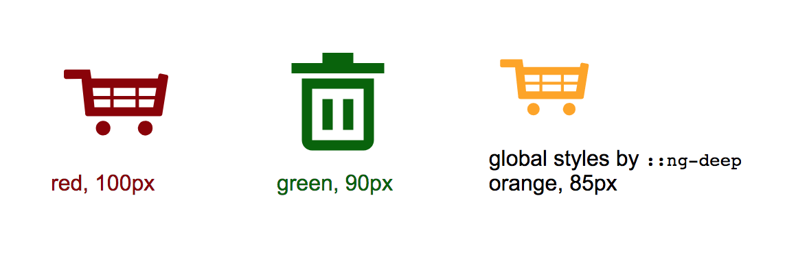

# SVG icon sprite package for Angular 4+

This [npm module](https://www.npmjs.com/package/ng-svg-icon-sprite) in Angular package format provides both
a solution for generating SVG sprites and a component for including them.

<a href="https://jannicz.github.io/ng-svg-icon-sprite/">
  <strong>See ng-svg-icon-sprite demo</strong>
</a>

<p>
  
</p>

## Use Cases

- include single-color icons from a sprite
- fill icons dynamically via CSS
- achieve hover/focus effects via CSS
- scale icons dynamically

## Installation

```
npm install ng-svg-icon-sprite --save
```

After installing the package you can import it into any application’s app.module.ts by simply including it in its
`@NgModule` imports array:

```javascript
import { SvgIconSpriteModule } from 'ng-svg-icon-sprite'; // <-- here

@NgModule({
  declarations: [
    AppComponent
  ],
  imports: [
    BrowserModule,
    SvgIconSpriteModule // <-- here
  ],
  bootstrap: [AppComponent]
})
export class AppModule { }
```

## Usage

To use your SVGs as a sprite you need to:

1. Generate a SVG sprite using the provided script
2. Include the `svg-icon-sprite` component with the proper sprite path and SVG name

### Step 1: Generate the sprite

Each time you add an icon, you need to run a script that generates the sprite. You might want to add it to your package.json:

```json
"scripts": {
  "create-icon-sprite": "svg2sprite ./src/assets/icons ./src/assets/sprites/sprite.svg --stripAttrs fill --stripAttrs stroke --stripAttrs id"
}
```

The used library [for sprite generation svg2sprite](https://github.com/mrmlnc/svg2sprite-cli) is already included as a
dependency that can be executed right away:

```
npm run create-icon-sprite
```

__Note: the fill and stroke properties are removed from the icon so they can be filled via CSS__

The script will take all SVG icons from `src/app/assets/icons` and create a sprite SVG into
`src/app/assets/sprites` using the [svg symbols technique](https://css-tricks.com/svg-symbol-good-choice-icons/).

```
app
└── assets
    └── icons (icons source)
        └── icon-1.svg
        └── icon-2.svg
    └── sprites (sprite destination)
        └── sprite.svg
```

### Step 2: Use the component

Now you can include icons by using the `svg-icon-sprite` component directive:

```html
<!-- here including 'cart' SVG from the sprite -->

<svg-icon-sprite
  [src]="'assets/sprites/sprite.svg#cart'"
  [width]="'22px'"
  [classes]="'my-icon-class'"
></svg-icon-sprite>

<!-- or with a dynamic icon name -->

<svg-icon-sprite
  [src]="'assets/sprites/sprite.svg#' + iconName"
  [width]="'50%'"
></svg-icon-sprite>
```

## Options

- `src` - icon source name, the syntax is `path/file#icon` where `path` is relative to app folder, `file` is
the name of the sprite and `icon` is the filename of the svg icon.
- `width` *optional* - width of the svg in any length unit, i.e. `32px`, `50%`, `auto` etc., default is `100%`
- `height` *optional* - the height of the svg in any length unit, if undefined height will equal the width
- `classes` *optional* - class name for this icon, default is `icon`
- `viewBox` *optional* - define lengths and coordinates in order to scale to fit the total space available (to be used if the viewBox of the SVG is missing)
- `preserveAspectRatio` *optional* - manipulate the aspect ratio, only in combination with `viewBox` (see SVG standard for details)

## Styling

To change the sprite color add a CSS `color` property to the component invoking svg-icon-sprite. The SVG component uses
the `currentColor` value to [pass the ancestor's color](https://css-tricks.com/cascading-svg-fill-color) through to the SVG shapes:

```css
/* host component styles */
color: red;
```

## Advanced Configuration

### Assets folder

If you have another folder structure than above, you can pass both your input and output path using the npm script:

```
svg2sprite sourcefolder destination/filename.svg
```

### Custom Styling

To access inner SVG properties like `fill` or `stroke`, you need to use Angular's `::ng-deep` selector in
the host component and select the `use` tag inside the SVG:

```css
.host-component ::ng-deep svg.icon use {
  fill: orange;
}
```

or to access SVG properties like height or width:

```css
.host-component ::ng-deep svg.icon {
  height: 85px;
  width: 85px;
}
```

__Note: make sure your CSS selector is strong enough here__

### Scaling and Sizing

If your SVG does not scale like expected (i.e. it is cropped or larger than desired) it might be lacking a `viewBox`.
You need to set the `viewBox` property manually to match the size of the exported shape. A combination of the correct
`viewBox` and width is required. Add the `viewBox` property and decrease/increase the last 2 values:

```html
<!-- i.e. lower '0 0 80 80' to '0 0 40 40' to scale up/down -->
<svg-icon-sprite
  [src]="'assets/sprites/sprite.svg#star'"
  [width]="'40px'"
  [viewBox]="'0 0 80 80'"
></svg-icon-sprite>
```

Still having trouble with scaling or sizing? Try to clean your SVG icons before processing them into sprites by
additionally using [svgo](https://www.npmjs.com/package/svgo). If this doesn't help either
[read this article](https://css-tricks.com/scale-svg/) about SVG scaling.

### Combining with SVG images containing inline styles

If you wish to combine the single-color icon pattern with SVGs that contain inline styles (i.e. multi-color) that should not be overridden by CSS,
you will have to provide a separate sprite file that keeps the stroke and fill attributes:

```json
"scripts": {
  "create-image-sprite": "svg2sprite ./src/assets/svg-images ./src/assets/sprites/image-sprite.svg"
}
```

The generated sprite will preserve it's original styles, but you won't ne able to fill it via CSS.

## Browser Support (tested)
- Chrome (63)
- Firefox (57)
- Safari 11
- Edge
- IE 11 (with polyfill, see below)

Check the [demo](https://jannicz.github.io/ng-svg-icon-sprite/) if it meets your requirements before using it.

### Polyfill for IE11 (and comparable)

Older browsers do not support referencing to (external) SVG symbols. To make it work for IE11 and lower you can add
[svg4everybody](https://github.com/jonathantneal/svg4everybody) to your `polyfills.ts` file:

```javascript
// Import and execute in polyfills.ts file
import * as svg4everybody from 'svg4everybody/dist/svg4everybody.js';
svg4everybody();
```

## Local development vs. npm package

For users that would like to clone/fork this repository: this repo contains all development files for the ng-icon-sprite
package while the [npm library](https://www.npmjs.com/package/ng-svg-icon-sprite) only includes the generated TypeScript package
in Angular package format. The latter was generated using [ng-packagr](https://www.npmjs.com/package/ng-packagr)
by running `ng-packagr -p ng-package.json`

## Author & License
- Jan Suwart | MIT License
